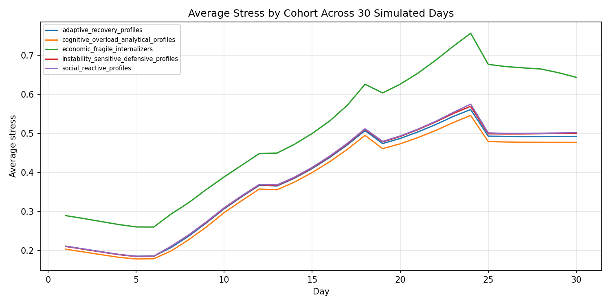
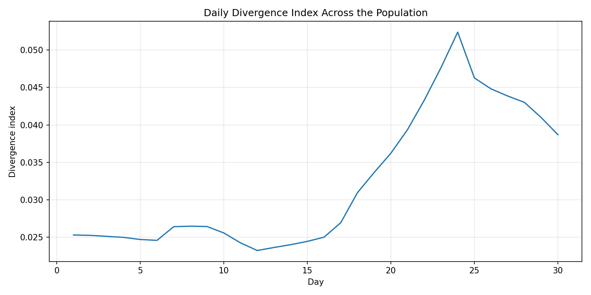
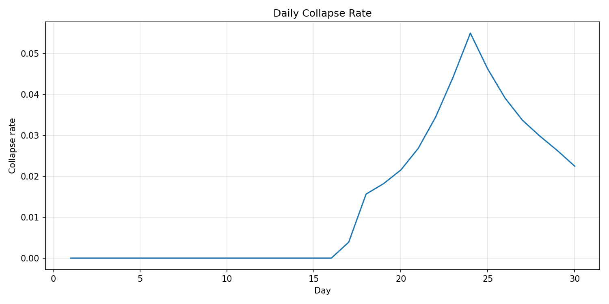

# LUX.AI — Behavioral Intelligence Engine

LUX.AI is a behavioral intelligence system designed to simulate, control, and adapt artificial agents based on structured personality models and dynamic state systems.

Unlike traditional AI chatbots, LUX.AI does not rely on language models to decide behavior.

Instead, behavior is computed through a deterministic and auditable system.

---

## 🧠 Core Idea

> Behavior is not generated — it is computed.

Every response is derived from:

- personality structure  
- internal state evolution  
- contextual pressure (events, stress, environment)  

---

## ⚙️ How It Works

LUX.AI combines multiple layers:

- **Structural Profiles** — personality architecture  
- **Dynamic State Engine** — stress, memory, recovery, collapse  
- **Intent Modeling** — what the agent wants to achieve  
- **Expression Layer** — how behavior is translated into language  
- **LLM Integration (Controlled)** — used only as a renderer  

---

## 🤖 LLMs Are Controlled — Not Trusted

Language models are only used when:

- they pass eligibility rules  
- they comply with behavioral constraints  

Otherwise:

→ The system falls back to deterministic behavior  

This ensures:
- consistency  
- predictability  
- reduced hallucination  

---

## 🌍 Synthetic Populations

LUX.AI can simulate thousands of agents over time.

This enables:

- behavioral analysis under stress  
- UX testing before real users  
- system-wide impact simulation  

---

## 📊 Simulation Example (30 Days)

📁 See: `/simulations/30_day_population/`

### Key Signals

- Stress evolution across cohorts  
- Collapse rate under pressure  
- Behavioral divergence between profiles  
- Recovery dynamics and residual effects  

### Example Visuals

---

## 🧪 Behavioral Difference (Same Scenario)

| Profile Type | Behavior |
|------|--------|
| Analytical | Focus on clarity, resolution, predictability |
| Emotional | Focus on frustration and relational impact |
| Defensive | Focus on urgency, action, escalation |

---

## 🚀 Current Capabilities

- Multi-profile behavioral system (~160+ operational profiles)  
- Dynamic state engine (stress, load, drift, collapse)  
- Expression engine (state → intent → language)  
- Hybrid LLM routing with validation and fallback  
- UX sandbox with session memory  
- Multi-agent behavioral simulation  

---

## 💡 Key Insights

- LLMs alone are not sufficient for reliable behavior  
- Controlled behavioral systems produce consistent outcomes  
- Personality + constraints = predictable AI  

---

## ⚠️ Disclaimer

This repository does not include:

- core behavioral equations  
- internal weighting systems  
- decision logic  
- routing policies  
- proprietary models  

This is a **public research layer** for demonstration and exploration.
